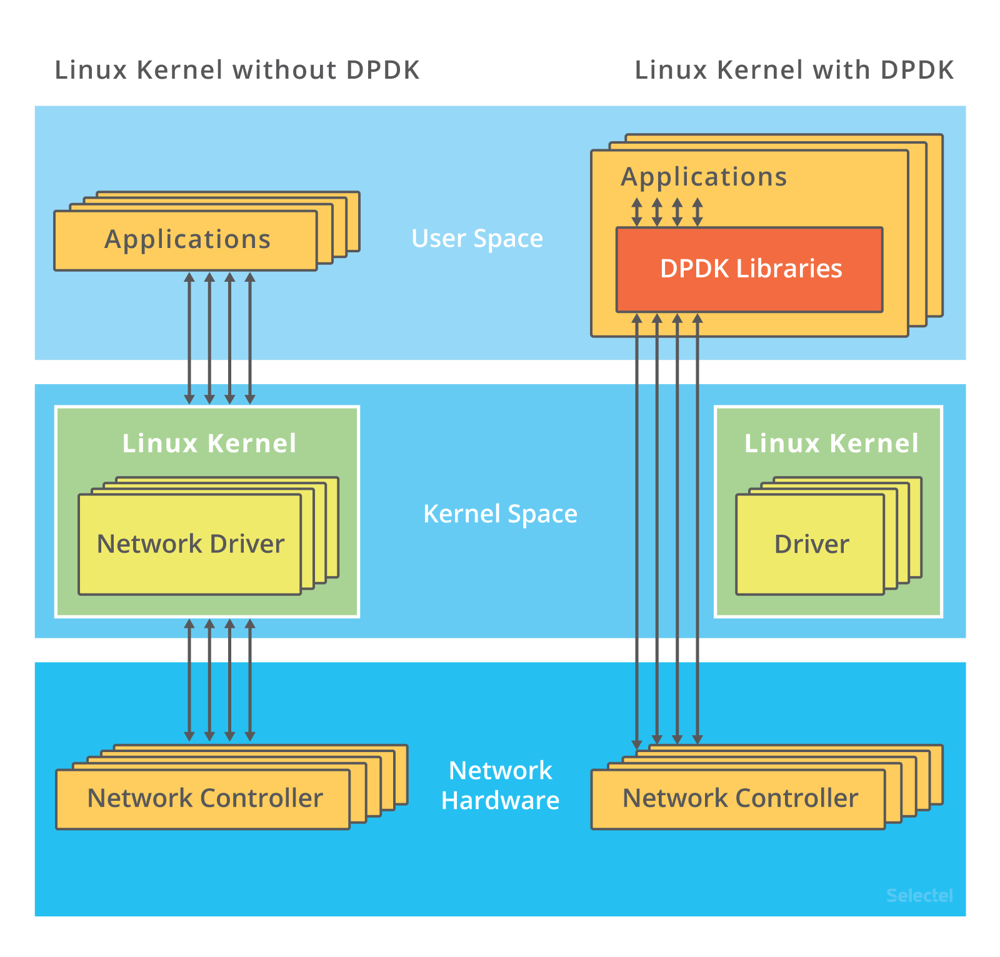

# DPDK pingpong application

This sample application measures dpdk ping performance. This is a client-server application.
Server waits for incoming ping packets and replies with pong packets.

Hence, you need to perform the below installation and set up steps on both machines.

Tried on 2 VBox Ubuntu 24.04 VMs with DPDK version 23.11. All the results presented are from testing in this setup. 

## Install DPDK

- Download dpdk archive
- Extract the archive
```
tar xf dpdk*.tar.gz
cd dpdk
```

- Build libraries, drivers and test applications.
```
meson build
ninja -C build
```

- To include the examples as part of the build, replace the meson command with:
```
meson -Dexamples=all build
```

- Reserve huge pages memory.
```
mkdir -p /dev/hugepages
mountpoint -q /dev/hugepages || mount -t hugetlbfs nodev /dev/hugepages
echo 64 > /sys/devices/system/node/node0/hugepages/hugepages-2048kB/nr_hugepages
```

## Set up local development environment

This application is a client 

Follow the steps in this video (timestamp 8:25-10:05 for dpdk installation, 10:05-13:10 for dpdk environment setup):

https://www.youtube.com/watch?v=0yDdMWQPCOI

## Build and Run

- Build
```
make
```

- Run Server
```
sudo ./build/pingpong -l 1,2 -- -p 0 -s -n 100 -S 08:00:28:f2:8f:08
```

- Run Client
```
sudo ./build/pingpong -l 1,2 -- -p 0 -c -n 200 -C 08:00:27:6e:fe:80 -S 08:00:27:f2:8f:08
```

`-C` is the client NIC MAC address, `-S` is the server NIC MAC address.

After you dedicate your port to DPDK, it will not be managed by Kernel, hence it will not be visible 
with usual commands like `ifconfig`. Instead, you can view the MAC addresses via the `dpdk-testpmd` utility.

## The results

- DPDK ping latencies:
```
====== ping-pong statistics =====
tx 200 ping packets
rx 200 pong packets
dopped 0 packets
min rtt: 78 us
max rtt: 21456 us
average rtt: 520 us
=================================
```

- Ordinary ping latency:
```
PING 192.168.8.111 (192.168.8.111) 56(84) bytes of data.
64 bytes from 192.168.8.111: icmp_seq=1 ttl=64 time=0.951 ms
64 bytes from 192.168.8.111: icmp_seq=2 ttl=64 time=1.50 ms
64 bytes from 192.168.8.111: icmp_seq=3 ttl=64 time=1.39 ms
64 bytes from 192.168.8.111: icmp_seq=4 ttl=64 time=1.47 ms
64 bytes from 192.168.8.111: icmp_seq=5 ttl=64 time=1.54 ms
64 bytes from 192.168.8.111: icmp_seq=6 ttl=64 time=1.48 ms
```

Note the difference of nanosecond and millisecond.

## The reasons

DPDK implements and utilizes other technologies and mechanisms for increased performance, such as: Kernel Bypass, Polling Mode Drivers, Huge Pages, 
NUMA Awareness, Core Affinity, Zero-Copy Buffer Management, Optimized Data Structures, Batch Processing, etc.

In the example above Kernel Bypass mechanism was implemented via DPDK, which is the reason of improved performance.


Traditional packet processing involves the operating system kernel's networking stack, which introduces significant
overhead due to context switching, interrupts, and packet copying between user space and kernel space.

DPDK bypasses the kernel, allowing applications to access network interface cards (NICs) directly from user space,
thereby reducing this overhead.

Traditional Networking Stack
In a traditional setup, packet processing involves the following steps:

Packet Reception: Network packets are received by the NIC (Network Interface Card).
Interrupt Handling: The NIC raises an interrupt to notify the CPU of the incoming packet.
Context Switching: The CPU switches context from user mode to kernel mode to handle the interrupt.
Packet Copying: The packet is copied from the NIC buffer to the kernel space memory.
Protocol Processing: The packet is processed by various network stack layers (IP, TCP/UDP, etc.).
Packet Copying: Finally, the packet is copied from kernel space to user space memory for the application to use.
Overheads in Traditional Stack
Interrupt Overhead: Handling interrupts involves context switching and can cause significant CPU overhead, especially at high packet rates.
Context Switching: Switching between user mode and kernel mode adds latency.
Memory Copying: Copying packets between the NIC, kernel space, and user space consumes CPU cycles and memory bandwidth.
Layer Processing: Each layer in the traditional network stack introduces additional processing overhead.
How Kernel Bypass Works
Kernel bypass eliminates these overheads by allowing user-space applications to interact directly with the NIC, bypassing the kernel's networking stack entirely. Here’s how it works in the context of DPDK:

Direct NIC Access: User-space applications can directly access the NIC hardware, often through memory-mapped I/O. This eliminates the need for kernel-mediated packet handling.
Polling Mode: Instead of relying on interrupts, applications poll the NIC for new packets. This reduces interrupt overhead and context switching.
Zero-Copy: Packets are processed directly in user space without being copied between kernel and user memory. This is often achieved using huge pages for memory allocation, ensuring large, contiguous memory regions that are efficiently accessed.
User-Space Drivers: DPDK includes user-space drivers for various NICs, allowing applications to directly interact with the hardware.
Memory Management: DPDK uses efficient memory management techniques, such as pre-allocated memory pools and cache-aligned data structures, to optimize packet processing.
Benefits of Kernel Bypass
Lower Latency: By eliminating context switches and reducing packet copying, kernel bypass significantly reduces the latency of packet processing.
Higher Throughput: Polling mode and efficient memory management allow for higher packet processing rates, often in the range of millions of packets per second.
Reduced CPU Overhead: Direct hardware access and zero-copy techniques minimize CPU cycles spent on packet handling, freeing up CPU resources for application processing.
Deterministic Performance: Kernel bypass provides more predictable and consistent performance, which is critical for applications such as high-frequency trading and real-time communications.
Kernel Bypass in DPDK
In DPDK, kernel bypass is implemented through a combination of:

User-Space Drivers: DPDK includes Poll Mode Drivers (PMDs) that operate entirely in user space.
Huge Pages: DPDK uses huge pages to allocate large, contiguous memory regions for packet buffers, reducing TLB misses and improving memory access times.
Polling Mechanism: Instead of interrupts, DPDK applications poll the NIC for new packets, reducing the overhead associated with interrupt handling.
